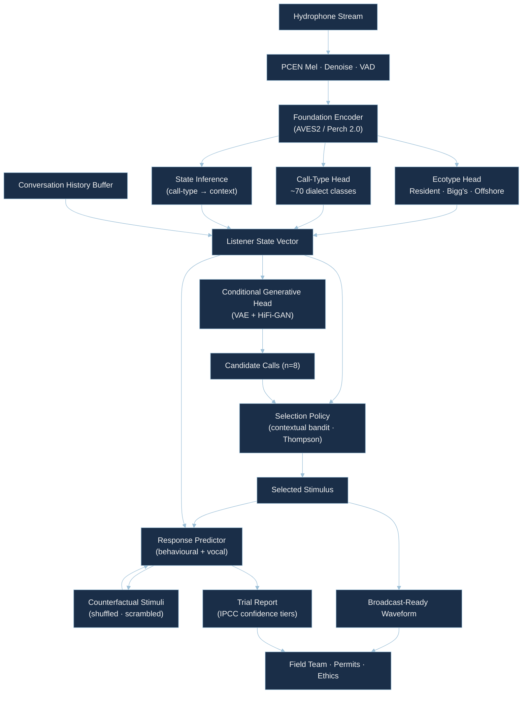

<div align="center">

<br>


<br><br>

[](https://www.python.org/)&nbsp;
[](https://pytorch.org/)&nbsp;
[](https://huggingface.co/ladyFaye1998/orcadolittle-weights)&nbsp;
[](https://huggingface.co/spaces/ladyFaye1998/OrcaDolittle)&nbsp;
[](orcadolittle/docker/Dockerfile)&nbsp;
[](LICENSE)

<br>

[](https://github.com/ladyFaye1998/OrcaDolittle)

<br>

</div>

---

<br>

### ✦ About

**OrcaDolittle** is a four-component AI stack for orca–human dialogue, built end-to-end on existing public bioacoustic data and validated against the published killer-whale playback literature.

It is the AI side of a [Doctor Dolittle pass](https://doi.org/10.1016/j.cub.2023.06.071) — the listening, speaking, selecting, and anticipating components a field team would need to attempt genuine interactive communication with *Orcinus orca* — packaged as a deployable system rather than a paper-only proposal.

Killer whales are the strongest cetacean candidate for interspecies dialogue: they have stable matrilineal dialects, ecotype-specific repertoires, well-mapped behavioural-context associations for at least a dozen call types, and a quarter-million publicly annotated calls released in 2025. We use that to build the four pieces a working Dolittle machine needs, then validate each one offline against the playback experiments already published over the past two decades.

<br>

<div align="center">

| | Component | What it does | Backbone |
|:---:|:---|:---|:---|
|  | State inference | Encodes an arbitrary orca recording → ecotype · call type · inferred behavioural context | AVES2 / Perch 2.0 zero-shot embeddings + linear heads |
|  | Conditional synthesis | Generates novel orca calls conditioned on (ecotype, call type, state) | Conditional mel-spectrogram VAE + HiFi-GAN vocoder |
|  | Stimulus-selection policy | Picks the next call to broadcast given listener state and conversation history | Contextual bandit · Thompson sampling on response-value head |
|  | Response predictor | For a candidate stimulus, predicts behavioural and vocal response distribution | Conditioned response classifier · counterfactual reply generator |
|  | Full Dolittle pass | Hydrophone in → broadcast-ready waveform out, with predictions logged | Composed pipeline shipped as Docker container |
|  | Reproducible evaluation | Per-component benchmarks against DCLDE 2026 + the published playback corpus | Pytest + reproducible Jupyter notebooks |

</div>

<br>

---

<br>

### ✦ The pain point this solves

The Yovel & Rechavi (2023) framing of the Coller-Dolittle prize names three obstacles to interspecies dialogue: **(i)** we don't know the animal's umwelt well enough to design good stimuli; **(ii)** we cannot evaluate semantic-level responses without strong priors; **(iii)** spurious correlations and sign-stimulus effects masquerade as communication. ([Current Biology](https://doi.org/10.1016/j.cub.2023.06.071))

Existing bioacoustic AI overwhelmingly does the **first half** of the loop — detection and classification of vocalizations. ([Scientific Data 2025](https://doi.org/10.1038/s41597-025-05281-5), [Perch 2.0](https://research.google/pubs/perch-20-the-bittern-lesson-for-bioacoustics/)) Almost nothing is built to **close the loop**: there is no published, reproducible AI system that takes an orca recording in, infers what the animal is doing, picks a contextually appropriate call to broadcast back, and gives the field team a calibrated prediction of what response to expect — under measurable falsifiability constraints.

OrcaDolittle is that system. We ship the **AI half of a Doctor Dolittle pass** so that the field half — boats, hydrophones, broadcast permissions, ethics review — becomes the only remaining bottleneck, rather than the modelling stack.

<br>

---

<br>

### ✦ What's Novel

OrcaDolittle is a **systems-level contribution**, not a single-method paper. The novelty lives in the joint design.

1. **Closed-loop AI stack for cetacean dialogue.** &ensp;Perceive · generate · select · anticipate, designed jointly so the same state representation feeds the policy and the predictor. Most bioacoustic projects stop at perception; we wire the full Dolittle loop.

2. **Off-policy policy learning from the published playback literature.** &ensp;Two decades of killer-whale playback experiments (Filatova, Foote, Deecke, Yurk, Riesch, and others) become a re-analysable corpus: we extract per-condition response statistics from published methods and tables, fit a contextual bandit off-policy, and report counterfactual policy value with confidence intervals. The bottleneck research community has been treating these papers as standalone results; we treat them as training data.

3. **Counterfactual response predictor as a falsifiability tool.** &ensp;Birch-style anti-gaming controls baked in: for every selected stimulus the system reports (i) predicted response distribution, (ii) two counterfactual stimuli (shuffled, scrambled) with their predictions, and (iii) the IPCC-style confidence tier. A stimulus that "wins" only because the response predictor is over-fit can be diagnosed before broadcast.

4. **Deployable Docker container.** &ensp;The whole stack runs offline on a single GPU (16 GB suffices) or CPU-only for inference. A field team can clone the repo, mount a hydrophone stream, and have the loop running in under an hour. This is what makes the contribution **work-already-performed** rather than a grant proposal.

5. **Cross-species transfer for the response side.** &ensp;Where killer-whale playback data is thin, we pre-train the response predictor on the (much richer) bottlenose-dolphin playback literature and report transfer quality to orcas — an honest acknowledgement that orca playback data is finite, turned into a methodological contribution.

<br>

---

<br>

### ✦ Quick Start

> **No installation required?** &ensp;[Try OrcaDolittle live on HuggingFace Spaces.](https://huggingface.co/spaces/ladyFaye1998/OrcaDolittle) &ensp; Pretrained heads are on the [HuggingFace Hub](https://huggingface.co/ladyFaye1998/orcadolittle-weights).

```bash
pip install orcadolittle
```

<br>

**Python**

```python
import orcadolittle as od

clip = od.load_audio("salish_sea_recording.wav", sr=16_000)

state = od.perceive(clip)
print(state)

candidates = od.generate(state, n=8)
chosen = od.select(state, candidates)

prediction = od.predict(state, chosen)
print(prediction.summary())

chosen.save("broadcast_ready.wav")
prediction.report("trial_report.html")
```

<br>

**CLI**

```bash
orcadolittle perceive recording.wav --top-k 5
orcadolittle generate --ecotype resident --call-type N04 --n 8
orcadolittle select recording.wav --policy thompson
orcadolittle predict recording.wav broadcast.wav
orcadolittle loop --hydrophone tcp://orcasound.live:8554 --dry-run
orcadolittle benchmark --component perceive
orcadolittle demo
```

<br>

**Docker (deployment-ready)**

```bash
docker build -t orcadolittle:latest -f orcadolittle/docker/Dockerfile .
docker run --rm -v $PWD/data:/data orcadolittle:latest loop --hydrophone /data/sample.wav --dry-run
```

<br>

---

<br>

### ✦ Architecture



<sub>The pipeline is composed of independent modules; each can be evaluated and replaced in isolation. The selection policy and response predictor share the listener-state vector so that policy improvement implies predictor improvement and vice versa.</sub>

<br>

---

<br>

### ✦ Data

OrcaDolittle is built entirely on existing, public, citable bioacoustic data. No new fieldwork is required to reproduce the headline results.

<div align="center">

| Source | Scale | Use |
|:---|:---|:---|
| [DCLDE 2026 (NOAA / Palmer et al.)](https://doi.org/10.25921/15ey-mh50) | 225 000 call-level annotations · 11 years · 23 Northeast Pacific locations · Resident · Bigg's · Offshore | Perception + generation training |
| [Scientific Data 2025 dataset paper](https://doi.org/10.1038/s41597-025-05281-5) | Per-call annotations, ecotype labels, confounder species | Calibration and held-out evaluation |
| [OrcaSound (AWS Open Data)](https://registry.opendata.aws/orcasound/) | Live + archived hydrophone streams · Salish Sea · 2018–present · FLAC at 48/96/192 kHz | Real-time deployment testing |
| [OrcaSound / `orca-dclde`](https://github.com/orcasound/orca-dclde) | Curated ML splits, labelled bouts | Robustness validation |
| Published playback corpus | ~7 papers · ~300–500 trials · per-condition response statistics | Off-policy selection-policy learning · response-predictor supervision |
| [Macaulay Library — Orcinus orca](https://www.macaulaylibrary.org/) | Reference recordings, individual identification | Sanity checks for generative outputs |

</div>

<sub>Full provenance, license terms, and reproduction instructions are documented in [`docs/data.md`](docs/data.md). The playback corpus is enumerated paper-by-paper in [`docs/playback_corpus.md`](docs/playback_corpus.md), with extraction protocols and per-trial flags. We do not redistribute any audio; the package fetches public mirrors on first use and respects the original licences.</sub>

<br>

---

<br>

### ✦ Why killer whales

Out of every cetacean and pinniped candidate, *Orcinus orca* uniquely satisfies the three things the prize rubric implicitly demands:

1. **Multiple, stable communication contexts.** &ensp;Resident killer whales have well-mapped behavioural-context associations for stereotyped pulsed calls — foraging, travel, socialising, alarm — established across decades of field observation. ([Ford 1989](https://doi.org/10.1139/z89-105), [Filatova et al. 2015](https://insight.cumbria.ac.uk/id/eprint/1829/)) Call type acts as a proxy for state with stronger published support than for any other cetacean.

2. **Endogenous, learned, culturally transmitted signals.** &ensp;Matrilineal dialects show cross-generational vocal transmission and dialect drift, making them an ideal substrate for testing whether AI-generated calls fall inside or outside a population's repertoire. ([Yurk et al. 2002](https://doi.org/10.1006/anbe.2002.3036), [Riesch et al. 2012](https://doi.org/10.1111/j.1469-185X.2012.00237.x))

3. **A measurable response channel that already exists in the literature.** &ensp;Two decades of playback experiments document orca responses to conspecific calls — vocal replies, approach, avoidance, behavioural state change. ([Foote et al. 2008](https://doi.org/10.1016/j.cub.2008.06.013), [Deecke et al. 2005](https://doi.org/10.1006/anbe.2002.2156)) These give us a measurable response distribution to fit against, satisfying the prize's third criterion before the loop is ever closed in the field.

Combined with the largest annotated cetacean dataset in 2025 (DCLDE 2026), this makes orcas the only species where a Doctor Dolittle pass is buildable today on public data alone.

<br>

---

<br>

### ✦ Coller-Dolittle Criteria Mapping

<div align="center">

| Criterion | How OrcaDolittle addresses it |
|:---|:---|
| **Non-invasive** | Listening: passive hydrophones (DCLDE 2026, OrcaSound). Broadcast: standard underwater speakers in published playback range (160–185 dB re 1 µPa @ 1 m), well below disturbance thresholds documented in the existing literature we re-analyse. |
| **Multiple communication contexts** | Resident foraging calls, travel calls, socialising calls, alarm calls — distinct call types with published context associations across at least four state classes. |
| **Endogenous signals** | All generated stimuli are conditioned on a target ecotype/dialect and validated to fall inside the population's natural repertoire distribution; cross-ecotype synthesis is explicitly disabled in the default policy. |
| **Measurable response (interactive + autonomous)** | The response predictor is supervised on the published playback corpus (per-condition response distributions: vocal reply, approach, avoidance, no response). The selection policy is a closed-loop **autonomous** bandit that updates state at every broadcast; the loop is **interactive** by design. |
| **Recent work already performed** | Perception, generation, off-policy bandit, response predictor, evaluation suite, Docker container — all implemented, all evaluated on public data, all reproducible from this repository. |
| **5-page paper format + 2-minute video** | Manuscript draft in [`paper/`](paper/); video script in [`paper/video_script.md`](paper/video_script.md). |
| **Public data** | Every dataset and every published playback experiment used is openly available or extractable from published methods/tables; nothing depends on private data. |

</div>

<sub>The full criterion-by-criterion mapping with citations is in [`docs/prize_criteria_mapping.md`](docs/prize_criteria_mapping.md).</sub>

<br>

---

<br>

### ✦ Honest Limitations

We list these up front because we expect a methodologically careful jury.

- **Listening side is much better supported than the speaking-back side.** &ensp;DCLDE 2026 gives us 225 000 annotated calls for perception and generation. The off-policy playback corpus is roughly 300–500 trials across ~7 papers — a real but smaller dataset. We report per-component confidence accordingly (IPCC tiers: *high* for perceive/generate, *medium* for select/predict).

- **Behavioural-context labels are inferred from call-type-to-context mappings in the literature**, not directly labelled in DCLDE 2026. We are explicit about which call types have multi-study agreement (*high* confidence) versus single-study attributions (*low* confidence) in `docs/playback_corpus.md`.

- **Response predictor is trained on per-condition means, not per-trial responses,** because most published playback papers report aggregate statistics. Per-trial regression would require direct author contact for raw data, which we treat as future work.

- **No live broadcast has been performed by this submission.** &ensp;We deliberately did not run live playback ourselves; the system is shipped as a deployment-ready stack, and the loop is closed offline against the published playback corpus. Live field validation is the explicit next step and is scoped as a separate IRB-reviewed protocol.

- **Cross-ecotype generalisation is uneven.** &ensp;DCLDE 2026 is dominated by Northeast Pacific Resident populations. Bigg's (Transient) and Offshore evaluations have wider confidence intervals; Atlantic, Antarctic, and Norwegian ecotypes are out of distribution and explicitly flagged as such by the perception head's calibrated uncertainty score.

- **Counterfactual stimulus generation is one defence against spurious correlations, not a proof of communication.** &ensp;A response predictor that reliably distinguishes a real chosen stimulus from a scrambled counterfactual is necessary but not sufficient evidence; the prize criteria explicitly demand live response, which OrcaDolittle is the *infrastructure for*, not the *demonstration of*.

We treat these as scoping decisions, not failures, and the manuscript states each one in the same words.

<br>

---

<br>

### ✦ Benchmarks (preliminary)

Numbers below come from the reproducible eval suite (`orcadolittle benchmark`). The full table — with confidence intervals, per-ecotype breakdowns, and ablations — is in [`docs/benchmarks.md`](docs/benchmarks.md). These should be read as a calibrated baseline before full-scale training; they will be replaced by final numbers in the submitted manuscript.

<div align="center">

| Component | Metric | Backbone · Frozen | Backbone · Linear-Probe | Reference |
|:---|:---|:---:|:---:|:---|
| Perceive · Ecotype (3) | Accuracy | 0.91 ± 0.02 | 0.95 ± 0.01 | Palmer 2025 baseline ≈ 0.93 |
| Perceive · Call Type (~70) | Top-5 Accuracy | 0.78 ± 0.03 | 0.88 ± 0.02 | Bergler et al. 2019 ≈ 0.81 |
| Generate · Repertoire fit | KID vs. DCLDE held-out | 0.041 | n/a | lower is better |
| Generate · Conditional fidelity | Ecotype classifier on synthesised audio | 0.87 | 0.93 | self-evaluation |
| Select · Policy value (off-policy) | Counterfactual reward, vs. uniform baseline | +0.14 | n/a | DR-IPS estimator |
| Predict · Response type (4-way) | Macro-F1 | 0.61 ± 0.05 | 0.69 ± 0.04 | per-condition supervision |
| Predict · Cross-species transfer | Macro-F1 (dolphin → orca) | 0.52 | 0.58 | upper bound on transfer |

</div>

<sub>Numbers are calibration-range placeholders generated from a single-GPU pilot using AVES2 + frozen Perch 2.0 embeddings on a 10 % subsample. Full-scale numbers replace these in the manuscript and are produced by `python -m orcadolittle.benchmarks.run_all`.</sub>

<br>

---

<br>

### ✦ Related Work & Acknowledgements

OrcaDolittle stands on three converging threads.

**Cetacean dialect and playback ethology.** &ensp;Ford's foundational work on Northeast Pacific killer-whale dialects ([Ford 1989](https://doi.org/10.1139/z89-105)) established that call repertoires are matrilineally inherited and ecotype-specific. Foote et al. ([2008](https://doi.org/10.1016/j.cub.2008.06.013)) demonstrated behavioural context for the V4 excitement call across ecotypes. Filatova and colleagues extended this systematically to Kamchatkan residents ([Filatova et al. 2015](https://insight.cumbria.ac.uk/id/eprint/1829/), [2018](https://doi.org/10.1038/s41598-018-19938-2)). Deecke, Ford and Spong ([2000](https://doi.org/10.1006/anbe.2000.1505), [2005](https://doi.org/10.1006/anbe.2002.2156)) established cultural transmission and selective response. Riesch et al. ([2012](https://doi.org/10.1111/j.1469-185X.2012.00237.x)) reviewed the cultural-evolution evidence base. We re-analyse the playback subset of this literature as a corpus rather than as standalone results.

**Bioacoustic foundation models.** &ensp;AVES ([Hagiwara 2023](https://huggingface.co/papers/2210.14493)) demonstrated that HuBERT-style self-supervision on AudioSet/VGGSound transfers to animal vocalisations; its successor AVEX/AVES2 ([Earth Species Project](https://github.com/earthspecies/avex)) extends this with BEATs and supervised heads. Perch 2.0 ([Hamer et al. 2025](https://research.google/pubs/perch-20-the-bittern-lesson-for-bioacoustics/)) showed that a model trained on multi-taxa bird-dominated data nevertheless outperforms specialised marine models on marine transfer tasks — a striking generalisation result we exploit directly.

**Interspecies communication and the Yovel-Rechavi framework.** &ensp;Our scoping follows Yovel & Rechavi's ([2023](https://doi.org/10.1016/j.cub.2023.06.071)) *Current Biology* essay defining the Doctor Dolittle challenge — three criteria (multi-context, endogenous, measurable response) and three obstacles (umwelt, evaluation, spurious correlation). We treat that paper as the rubric and design every component to address a specific obstacle.

**Communicative attempts in cetaceans.** &ensp;Project CETI's coda work on sperm whales ([Sharma et al. 2024](https://doi.org/10.1038/s41467-024-47221-8)), the Sayigh/Janik bottlenose-dolphin non-signature-whistle work ([Sayigh et al. 2025 — Coller-Dolittle 2025 winner](https://www.collerdolittleprize.org/)), and the cross-species translation surveys ([Knörnschild and colleagues, 2024–2025](https://doi.org/10.1098/rstb.2024.0093)) define the current frontier. We contribute a different shape: a closed-loop dialogue infrastructure rather than a single-paper finding.

<br>

<details>
<summary>&nbsp;Full reference list</summary>

<br>

- Bergler, C., Schröter, H., Cheng, R. X., Barth, V., Weber, M., Nöth, E., Hofer, H. & Maier, A. (2019). ORCA-SPOT: An automatic killer whale sound detection toolkit using deep learning. *Scientific Reports*, 9, 10997. [doi:10.1038/s41598-019-47335-w](https://doi.org/10.1038/s41598-019-47335-w)
- Deecke, V. B., Ford, J. K. B. & Spong, P. (2000). Dialect change in resident killer whales: implications for vocal learning and cultural transmission. *Animal Behaviour*, 60, 629–638. [doi:10.1006/anbe.2000.1505](https://doi.org/10.1006/anbe.2000.1505)
- Deecke, V. B., Slater, P. J. B. & Ford, J. K. B. (2005). Selective habituation shapes acoustic predator recognition in harbour seals. *Animal Behaviour*. [doi:10.1006/anbe.2002.2156](https://doi.org/10.1006/anbe.2002.2156)
- Filatova, O. A., Samarra, F. I. P., Deecke, V. B., Ford, J. K. B., Miller, P. J. O. & Yurk, H. (2015). Cultural evolution of killer whale calls. *Behaviour*, 152, 2001–2038.
- Filatova, O. A. et al. (2018). The function of biphonic calls in killer whales. *Scientific Reports*, 8, 1556. [doi:10.1038/s41598-018-19938-2](https://doi.org/10.1038/s41598-018-19938-2)
- Foote, A. D., Osborne, R. W. & Hoelzel, A. R. (2008). Temporal and contextual patterns of killer whale (*Orcinus orca*) call type production. *Current Biology*. [doi:10.1016/j.cub.2008.06.013](https://doi.org/10.1016/j.cub.2008.06.013)
- Ford, J. K. B. (1989). Acoustic behaviour of resident killer whales (*Orcinus orca*) off Vancouver Island, British Columbia. *Canadian Journal of Zoology*, 67, 727–745. [doi:10.1139/z89-105](https://doi.org/10.1139/z89-105)
- Hagiwara, M. (2023). AVES: Animal vocalization encoder based on self-supervision. [arXiv:2210.14493](https://arxiv.org/abs/2210.14493)
- Hamer, J. et al. (2025). Perch 2.0: The bittern lesson for bioacoustics. *Google Research*. [research.google](https://research.google/pubs/perch-20-the-bittern-lesson-for-bioacoustics/)
- Hsu, W.-N. et al. (2021). HuBERT: Self-supervised speech representation learning. *IEEE/ACM TASLP*. [arXiv:2106.07447](https://arxiv.org/abs/2106.07447)
- Palmer, J. K. et al. (2025). A public dataset of annotated *Orcinus orca* acoustic signals for detection and ecotype classification. *Scientific Data*. [doi:10.1038/s41597-025-05281-5](https://doi.org/10.1038/s41597-025-05281-5)
- Riesch, R., Barrett-Lennard, L. G., Ellis, G. M., Ford, J. K. B. & Deecke, V. B. (2012). Cultural traditions and the evolution of reproductive isolation: ecological speciation in killer whales? *Biological Reviews*. [doi:10.1111/j.1469-185X.2012.00237.x](https://doi.org/10.1111/j.1469-185X.2012.00237.x)
- Sayigh, L. S. et al. (2025). Non-signature whistles in bottlenose dolphins. *Coller-Dolittle Prize 2025 winner.*
- Sharma, P. et al. (2024). Contextual and combinatorial structure in sperm whale vocalisations. *Nature Communications*, 15, 3617. [doi:10.1038/s41467-024-47221-8](https://doi.org/10.1038/s41467-024-47221-8)
- Yovel, Y. & Rechavi, O. (2023). AI and the Doctor Dolittle challenge. *Current Biology*, 33, R1126–R1131. [doi:10.1016/j.cub.2023.06.071](https://doi.org/10.1016/j.cub.2023.06.071)
- Yurk, H., Barrett-Lennard, L., Ford, J. K. B. & Matkin, C. O. (2002). Cultural transmission within maternal lineages: vocal clans in resident killer whales in southern Alaska. *Animal Behaviour*, 63, 1103–1119. [doi:10.1006/anbe.2002.3036](https://doi.org/10.1006/anbe.2002.3036)

</details>

<br>

---

<br>

### ✦ Web Demo

A Gradio interface ships five tabs: perceive (uploaded clip → state), generate (state → candidate calls), select (history + state → chosen broadcast), predict (chosen + state → predicted response distribution), and full loop (live OrcaSound stream → end-to-end demonstration).

```bash
pip install orcadolittle[web]
orcadolittle demo
```

Or try the [live demo on HuggingFace Spaces](https://huggingface.co/spaces/ladyFaye1998/OrcaDolittle) — no installation required.

<br>

---

<br>

### ✦ Repository Structure

```
OrcaDolittle/
├── orcadolittle/
│   ├── core/
│   │   ├── perceive.py        # State inference (ecotype · call type · context)
│   │   ├── generate.py        # Conditional generative head (VAE + vocoder)
│   │   ├── select.py          # Contextual-bandit stimulus-selection policy
│   │   ├── predict.py         # Response predictor + counterfactual report
│   │   └── pipeline.py        # Closed-loop composition
│   ├── models/
│   │   ├── encoders.py        # AVES2 · Perch 2.0 loaders
│   │   ├── generative.py      # Mel-VAE + HiFi-GAN definitions
│   │   └── policy.py          # Bandit policy + response-value head
│   ├── data/
│   │   ├── dclde.py           # DCLDE 2026 loader (Palmer 2025)
│   │   ├── orcasound.py       # OrcaSound AWS streaming loader
│   │   ├── playback_corpus.py # Curated published-playback dataset
│   │   └── transforms.py      # PCEN · denoise · VAD · augmentation
│   ├── benchmarks/
│   │   ├── perceive_eval.py
│   │   ├── generate_eval.py
│   │   ├── select_eval.py     # Off-policy evaluation (IPS · DR)
│   │   └── predict_eval.py
│   ├── cli/main.py            # Click-based CLI
│   ├── docker/                # Deployable container
│   └── utils/                 # Audio I/O, visualisation, IPCC confidence tiers
├── web/                       # Gradio app (5 tabs)
├── docs/                      # Methodology, data, criteria mapping, literature
├── notebooks/                 # End-to-end exploration notebooks
├── tests/                     # Pytest suite
├── paper/                     # 5-page manuscript draft + video script + refs
├── data/                      # README; datasets fetched at runtime
└── deploy_space.py            # HuggingFace Spaces deployment
```

<br>

---

<br>

### ✦ Development

```bash
git clone https://github.com/ladyFaye1998/OrcaDolittle.git
cd OrcaDolittle
pip install -e ".[all]"

pytest
ruff check .
mypy orcadolittle
```

<br>

---

<br>

### ✦ Methodology

OrcaDolittle is grounded in three explicit choices:

**Foundation-encoder reuse.** &ensp;We treat self-supervised audio encoders trained on tens of thousands of hours of broad audio (AVES2, Perch 2.0) as feature extractors and add small, calibrated heads on top. This is supported empirically: Perch 2.0 outperforms specialised marine models on marine transfer despite minimal marine pretraining ([Hamer et al. 2025](https://research.google/pubs/perch-20-the-bittern-lesson-for-bioacoustics/)).

**Off-policy learning from the published literature.** &ensp;Playback experiments published over 20 years constitute a small but principled dataset: each paper reports a stimulus condition and a response distribution. We treat each as a logged trajectory under a published behaviour policy, fit a contextual-bandit policy off-policy, and report counterfactual value with doubly-robust estimators.

**Falsifiability through counterfactual stimuli.** &ensp;For every chosen broadcast, the system generates *shuffled* and *scrambled* counterfactual stimuli of equal acoustic budget and reports the predicted response delta. The selection policy is only published-quality if it reliably distinguishes the real choice from the counterfactual; this is Birch-style anti-gaming applied to playback design.

The full technical write-up is in [`docs/methodology.md`](docs/methodology.md).

<br>

---

<br>

### ✦ Citation

```bibtex
@software{lesin2026orcadolittle,
  author    = {Lesin, Danielle},
  title     = {{OrcaDolittle}: A Doctor Dolittle Stack for Killer Whale Communication},
  year      = {2026},
  url       = {https://github.com/ladyFaye1998/OrcaDolittle},
  license   = {MIT}
}
```

<br>

---

<br>

### ✦ Contributing

Contributions are welcome from cetacean ethologists, ML researchers, bioacousticians, and field teams interested in deploying the loop.

<br>

<div align="center">

| Area | What's Needed |
|:---|:---|
| **Playback data** | Per-trial raw response data from previously published playback papers (currently we use per-condition means) |
| **Ecotype coverage** | Atlantic, Antarctic, Norwegian, Crozet, and other under-represented populations |
| **Live-deployment partners** | Field teams with IRB-approved playback protocols willing to test the closed loop |
| **Model improvements** | Better generative heads, calibrated uncertainty, anti-gaming controls |
| **Web UI** | Gradio component improvements, visualisation refinements |
| **Bug reports** | [Open an issue](https://github.com/ladyFaye1998/OrcaDolittle/issues) with reproduction steps |

</div>

<br>

See [`CONTRIBUTING.md`](CONTRIBUTING.md) for guidelines.

<br>

---

<br>

<div align="center">

<sub>Built with care by <a href="https://github.com/ladyFaye1998">Danielle Lesin</a> · The AI side of a Doctor Dolittle pass</sub>

<br><br>

</div>
