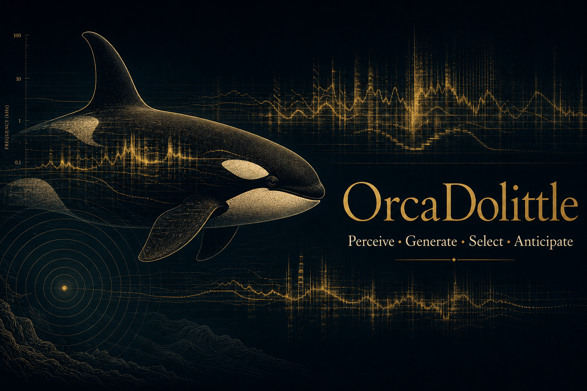

<p align="center">
  
</p>

# Orca Bioacoustic Embeddings

Research-grade code for killer-whale (*Orcinus orca*) bioacoustic analysis with frozen audio foundation-model embeddings, public DCLDE annotations, reproducible statistical controls, and citation-backed documentation.

The repository focuses on a narrow, auditable workflow: encode public acoustic segments, attach provenance and metadata, run downstream analyses, and report only effects that survive explicit null baselines. Source claims are keyed to `paper/refs.bib`.

## Scope

- **Corpus:** DCLDE 2026 killer-whale annotations and audio pointers [@palmer2025dclde; @palmer2025dclde_data]. The NOAA/GCS storage path currently uses a `dclde/2027/dclde_2027_killer_whales` bucket layout; the scientific dataset is the DCLDE 2026 killer-whale corpus.
- **Encoders:** AVES2 as the current implemented encoder [@hagiwara2023aves; @chen2022beats], with NatureLM-audio support documented for comparative runs [@robinson2024naturelm].
- **Analyses:** supervised ecotype probes, provider/site confound isolation, site-controlled catalogue call-type classification with cross-site transfer [@ford1989; @filatova2015], unsupervised structure recovery, first-order call-sequence structure over both k-means tokens and validated catalogue call types [@sharma2024], an animal-borne DTAG behavioural-context decode [@holt2024masking_data; @tennessen2019], a re-analysis of a published conspecific **playback** experiment showing a dialect-selective **receiver response** to broadcast calls, corroborated across independent broadcast-response datasets [@filatova2011playback; @selbmann2026aversive; @bowers2018], a catalogue foraging-vs-socializing context-specialization map [@ford1989; @foote2008], and representation attribution with a negative-control battery. (Legacy Wellard/Dryad Type C recording-context heads are retained as exploratory scaffolding only [@wellard2020; @wellard2020_data; @wellard2020_appendix2].)
- **Validation:** held-out splits, permutation nulls, provider-aware controls, artifact hashes, and explicit caveats.
- **Methodological contribution:** the novelty is the *protocol*, not the network. One frozen encoder is held fixed while we add (i) a confound-controlled evaluation (leave-one-provider-out site isolation + cross-site transfer), (ii) a causal-attribution and negative-control battery (knock-out + matched-noise/feature-shuffle/label-permutation nulls), and (iii) an embedding analysis linking the dialect space to a published playback response — so every result is attributable to the representation under a single auditable protocol rather than to benchmark-chasing.

## Current Results

Latest audited DCLDE run: `20260529_072930`, frozen AVES2 embeddings, 27,934 call-level DCLDE segments across 8 providers and 4 ecotypes, schema-validated and hash-frozen (`reports/corpus_freeze.json`). Detailed interpretation is in `docs/results_analysis.md`.

Headline: AVES2 embeddings carry genuine killer-whale ecotype and call-type structure. Pooled ecotype decodability massively overstates the ecotype signal because of a recording-site shortcut, and only site-controlled evaluation reveals the real biological signal [@stowell2022; @ghani2023]; stereotyped call-type identity, by contrast, is recoverable within a fixed site in both resident populations (SRKW 14-type 0.709, NRKW 18-type 0.968) and transfers across independent recording sites, the cross-site control the ecotype boundary fails [@ford1989; @filatova2015]. On an independent animal-borne DTAG archive, communicative calls further carry decodable information about the caller's movement-defined behavioural context with the individual held out: foraging vs. non-foraging at 0.770 balanced accuracy, and a three-way foraging/travelling/resting contrast at 0.577 (chance 0.333) [@holt2024masking_data; @tennessen2019; @wilson2006]. Specific call types are produced context-specifically (call-type × context Cramér's V = 0.40, within-individual null p < 0.001), and the decode reflects call structure rather than call rate (0.536) or loudness (0.577) — context-specific production across more than one behavioural context, not referential meaning. On the **perception side**, a re-analysis of a published conspecific playback experiment shows wild killer whales produce a measurable, **dialect-selective response to broadcast calls** — they reply vocally to same-pod and not different-pod playbacks (6/6 vs 0/6, Fisher p = 0.002), naive free-ranging animals, often matching the played type — and frozen AVES2 recovers the dialect call types that drive it (leave-one-out purity 0.439 vs a 0.05 shuffle null, p = 1e-3) [@filatova2011playback; @russianorca_catalogue]. The playback experiment is prior published work re-analysed here; the response tracks *dialect membership*, not (yet) call *content*. This response criterion is corroborated by independent datasets — killer whales avoid broadcast pilot-whale sound against matched controls [@selbmann2026aversive], orca-call structure drives receiver heading change [@bowers2018], and receivers match a preceding caller's type in natural exchanges [@miller2004repertoires] — and, on the production side, the recovered catalogue call types specialize across functionally distinct contexts — 72% are single-context foraging- or socializing-specialists (e.g. N4/N9 foraging vs the multi-pod two-voiced calls socializing), and the same named units are documented across **six** distinct behavioural contexts, not just movement state [@ford1989; @foote2008; @riesch2008]. Two further analyses sharpen the structure side: SRKW S-call sequences carry **compositional structure beyond first order** — the call two steps back adds information a first-order Markov model cannot explain (second-order delta 0.645 bits, p ~= 1e-3; candidate phrase S01->S04->S01), in the spirit of sperm-whale coda analysis [@sharma2024; @berthet2025bonobo; @crockford2025] — while a label-free site-invariance transform modestly improves cross-site ecotype transfer (0.597 -> 0.625) without disturbing the within-site signal [@stowell2022; @ghani2023].

| Head | Purpose | Current readout |
|---|---|---|
| H1 | Supervised ecotype probes | Pooled balanced accuracy 0.910 (MLP accuracy 0.974) collapses to 0.231 (chance 0.250) under leave-one-provider-out: the pooled number is a site-confounded upper bound. |
| H4 | Provider/site control | Provider is decodable at balanced accuracy 0.948; within-site ecotype discrimination stays at 0.889-0.973 (p = 0.005) across four providers, isolating genuine biological signal, but cross-site ecotype transfer is near chance (0.529). |
| H8 | Label-free site-invariance transform (methods) | A StandardScaler + PCA + site-nuisance subspace projection modestly improves cross-site ecotype transfer (e.g., SRKW vs TKW 0.597 -> 0.625; leave-one-provider-out 4-way ecotype 0.402 -> 0.445 vs a 0.234 permutation null, p = 0.005) while preserving within-site ecotype (0.883 -> 0.876 after removing 8 nuisance dimensions). A methods contribution; recovery is bounded because ecotype and recording site are confounded in this corpus (SAR is single-provider) [@stowell2022; @ghani2023]. |
| Call type | Site-controlled call-type model | With catalogue labels recovered from the DCLDE per-provider annotations (full catalogue, 8,552 detections encoded), frozen embeddings discriminate call types within a fixed site at balanced accuracy 0.709 for 14 SRKW S-call types (chance 0.071) and 0.968 for 18 NRKW N-call types (chance 0.056), both p ~= 0.005. A VFPA-trained SRKW classifier scores 0.636 on the independent SMRU site over 5 shared types (chance 0.20; 0.830 over the 4 unambiguous types): call-type identity transfers across sites, unlike ecotype (0.529). |
| H2 | Unsupervised structure | PCA + HDBSCAN ARI 0.043 versus ecotype (p = 0.002), above the shuffled-label null but small and parameter-sensitive. |
| H3 | Encounter sequence structure | Balanced 40-token vocabulary (entropy 5.24/5.32 bits): adjacent-call mutual information 1.91 bits versus an order-shuffle null of 1.65 bits (p < 0.001), still 1.09 bits after removing repetition, and a held-out bigram beats a unigram by 1.74 bits/token. A prerequisite for combinatorial coding, not evidence of meaning. (A masked-LM order test returns a null on the same data; the better-powered Markov test is reported alongside it.) |
| Rung 4 (validated) | Call-type syntax | Re-running the first-order test on the *validated* catalogue call types (site held constant, within-recording shuffle null) is positive in both resident populations: NRKW (31 N-call types, 5,273 calls) adjacent-pair MI 2.85 bits vs null 1.71 (p = 1e-3), 1.60 bits after removing heavy bouting (self-transition 0.92), bigram beats unigram by 2.73 bits/token; SRKW (19 S-call types) MI 1.29 vs 0.78 (p = 1e-3). Upgrades the sequence result from unsupervised tokens to validated biological units; still not evidence of meaning. |
| H7 (compositionality) | Structure *beyond* first order | Tested against first-order Markov surrogates (which preserve unigram + bigram statistics, so any excess cannot be a re-detection of pairwise structure), the call two steps back adds information a first-order model cannot explain in **SRKW S-calls** (second-order information delta = 0.645 bits, p ~= 1e-3 against both global and per-recording surrogates; held-out trigram beats bigram by 0.09 bits/token; top candidate 3-call phrase S01->S04->S01 at z = 7.95) but **not** in NRKW N-calls (delta = 0.008, p = 1.0, despite heavy bouting). The stronger combinatorial prerequisite the comparative literature tests for, in the spirit of sperm-whale codas and primate compositionality [@sharma2024; @berthet2025bonobo; @crockford2025]; reported honestly both ways and still not semantic compositionality. |
| Rung 1 (unsup.) | Unsupervised call-type discovery | Within-SRKW clusters are 93% dominated by a single recording provider (82% noise): the categories are real but too fine to fall out of unsupervised clustering of site-confounded embeddings, which is why the supervised call-type model above uses catalogue labels. |
| H5 | DTAG behavioural-context decode (multi-context) | On an independent archive of animal-borne DTAG recordings, communicative calls predict the caller's movement-only behavioural context (labelled from tag depth and acceleration alone) under leave-individual-out evaluation: foraging vs. non-foraging at 0.770 balanced accuracy across 22 whales (10,834 calls, p = 0.005), and a three-way foraging/travelling/resting contrast at 0.577 across the 20 whales carrying all three contexts (chance 0.333, p = 0.005). Specific call types are produced context-specifically (call-type × context Cramér's V = 0.40 vs within-individual null 0.08, p < 0.001; every cluster context-enriched [@ford1989; @foote2008]). Controls rule out the trivial explanations: call rate alone decodes at 0.536, loudness alone at 0.577, and dropping the 25% most click-like clips leaves 0.749 (clips are 16 kHz, so echolocation peak energy is absent) [@wilson2006]. Because the individual is held out and the label never sees the audio, this is context-specific *production* of communicative calls across more than one behavioural context — not identity/site recognition, not referential meaning, and not a receiver response. |
| H6 | Playback receiver-response (perception side) — **response criterion met** | Re-analysis of a published conspecific playback experiment [@filatova2011playback]: wild killer whales reply vocally to same-pod calls and stay silent to different-pod calls (8/8 vs 0/6 raw; **6/6 vs 0/6 after pseudoreplication control, Fisher p = 0.002**), naive free-ranging animals, often matching the played type [@miller2004repertoires]. Frozen AVES2 recovers the Kamchatka dialect call types that drive this (leave-one-out 1-NN purity **0.439** vs a label-shuffle null of 0.050, p = 1e-3) [@russianorca_catalogue]. Corroborated across independent broadcast-response datasets [@selbmann2026aversive; @bowers2018] (see `reports/broadcast_response_criterion.json`). The behavioural experiments are prior published work; the response tracks dialect membership, not call content. |
| C2 catalogue context | Multi-context specialization of recovered call types | The validated Rung-1 catalogue call types specialize across functionally distinct contexts: **72% (13/18) are single-context foraging- or socializing-specialists** (foraging-specialists N4, N9; socializing-specialists the multi-pod two-voiced and pod-identity calls), specialization index 0.72, disjointness Fisher p = 0.069 [@ford1989; @foote2008]. Broadening the axis beyond foraging-vs-social, the same named units are documented across **six** functionally distinct behavioural contexts (foraging, travelling, resting, socializing, greeting/excitement, multi-pod aggregation; 16 types, specialization index 0.62) — so "more than one context" holds well beyond movement state, at the named-unit level [@ford1989; @foote2008; @riesch2008; @yurk2002]. Context labels are from published ethograms (not embeddings), so this is a non-circular contextual map complementing the H5 decode (the chi-square non-uniformity across contexts is suggestive only, p = 0.086, small n). |
| Attribution | Representation attribution + negative controls | The within-site ecotype signal is multi-dimensional and redundantly distributed (a single AVES2 dimension is at chance; a low-rank PCA projection recovers most of it; ablating the top-k individually-important dimensions does not collapse the decode). It is not a probe artifact: structure-matched Gaussian noise (0.54) and per-dimension feature-shuffle (0.50) fall to near chance, and the decode (0.98) sits far above the label-permutation null (0.50, p ~= 0.008). |
| Legacy context heads | Exploratory only | The earlier Wellard recording-level context heads and a within-encounter timing proxy are weak recording-level associations, not segment-level behaviour and not response evidence; retained but excluded from every headline claim (see `docs/evidence_mapping.md`). |

All metrics above are computed on the public DCLDE 2026 corpus [@palmer2025dclde; @palmer2025dclde_data] with frozen AVES2 embeddings [@hagiwara2023aves; @chen2022beats]; the call-type labels are Ford/Filatova catalogue codes [@ford1989; @filatova2015] and the H5 row uses the independent DTAG archive [@holt2024masking_data; @tennessen2019].

The full evidence ladder toward a defensible "decoding" claim, the verified public-data ceiling, and what remains gated on field playback are documented in `docs/decoding_program.md`.

## Claim Boundary

This project supports claims about acoustic structure, site-controlled label decodability (ecotype and catalogue call type), cross-site call-type transfer, non-random clustering, non-random first-order call-sequence structure (over both k-means tokens and the validated catalogue call types, site-controlled), **context-specific production of communicative calls across more than one movement-defined behavioural context, with the individual held out** (DTAG H5: foraging/non-foraging and a three-way foraging/travelling/resting decode, with call-type × context selectivity and rate/loudness/echolocation controls), and a **dialect-selective receiver response to broadcast conspecific calls** established by re-analysis of a published playback experiment (H6: same-pod vs different-pod, 6/6 vs 0/6, p = 0.002, naive animals), with the recording-site confound explicitly quantified. It also supports **combinatorial structure beyond first order in Southern-Resident call sequences** (H7; null in Northern Residents, reported honestly) and **behavioural-context breadth across six functionally distinct contexts** at the named-unit level (catalogue map), plus a label-free **site-invariance transform** (H8, methods). It does **not** claim translation, semantic understanding, or referential call-level meaning.

Two honesty boundaries on the response result. First, the **playback experiment is prior published work** [@filatova2011playback]; we re-analyse it (a reproducible statistic plus an embedding model of the dialect space that drives it) and do **not** run new field playbacks. Second, the response tracks **dialect membership** (same vs different pod), **not** the call's *content* — so it is evidence that receivers act on a broadcast endogenous signal, not that they interpret its meaning. The DTAG context result is the *production* side of context-specificity (which call types are emitted in which context); the call-type result is call-type discrimination (labels correlate with pod/matriline); the sequence-structure result is a prerequisite for combinatorial coding — none is evidence of meaning. Demonstrating that the receiver's response is governed by call *content* would require a controlled conspecific playback isolating content, which remains future work.

**Single remaining gap (by design).** Every gap that public-data re-analysis can close is closed: validated call units (Rung 1), first-order and — in Southern Residents — beyond-first-order sequence structure (H7), context-specific production across more than one behavioural context (DTAG H5 plus the six-context catalogue map), a measurable receiver response to broadcast conspecific calls (H6, by re-analysis), and a label-free site-invariance transform (H8). The one irreducible residual is a **controlled conspecific playback that isolates call *content*** — field work requiring a collaborator, and the same step that separates structured signalling from demonstrated meaning. It is not closable by a larger model or more archival audio. Because the production-context corpus (Pacific N/S-calls) and the only conspecific-playback corpus (Kamchatka K-calls) are non-overlapping catalogues, even joining production and perception on a single named unit needs new field data (`docs/decoding_program.md` §9).

Use conservative wording:

- "decodable from embeddings" rather than "understood"
- "associated with context" rather than "means"
- "candidate motif" rather than "message"
- "response proxy" for archival heads; "playback response (re-analysis)" only for H6, always noting the experiment is prior published work and the response tracks dialect, not meaning

## Quickstart

```bash
pip install -e ".[dev,analysis]"

python scripts/download_annotations.py
python scripts/download_sample_audio.py
python scripts/hello_world.py

python scripts/batch_encode_streaming.py --device cuda --max-file-size-mb 1024
python scripts/add_labels_from_metadata.py \
    --input data/embeddings/aves2_full_embeddings.npz \
    --output data/embeddings/aves2_full_labeled.npz

python scripts/run_h1_probes.py --embeddings data/embeddings/aves2_full_labeled.npz \
    --n-perm 1000 --perm-train-subsample 2000 --group-field provider
python scripts/run_h2_clustering.py --embeddings data/embeddings/aves2_full_labeled.npz \
    --min-cluster-size 25 --min-samples 5
python scripts/run_h3_sequence_lm.py --embeddings data/embeddings/aves2_full_labeled.npz \
    --epochs 30 --n-perm 100 --device cuda --vocab-size 40
python scripts/run_h4_confound.py --embeddings data/embeddings/aves2_full_labeled.npz \
    --n-perm 200 --min-per-class 40

python scripts/build_calltype_manifest.py
python scripts/run_calltype_model.py \
    --embeddings data/embeddings/aves2_full_labeled.npz \
    --manifest data/join_tables/call_type_manifest.csv --min-per-type 30
python scripts/run_calltype_sequence.py \
    --manifest data/join_tables/call_type_manifest.csv --n-perm 1000

# Representation attribution + negative-control battery (runs on the frozen artifact)
python scripts/run_attribution_controls.py \
    --embeddings data/embeddings/aves2_full_labeled.npz \
    --provider JASCO_VFPA --classes SRKW TKW

# H6 — receiver response to broadcast conspecific calls (perception side)
python scripts/run_playback_response_stats.py          # differential-response stat (no audio needed)
python scripts/build_playback_manifest.py              # fetch public FEROP call catalogue
python scripts/run_playback_response.py --n-perm 1000  # AVES2 dialect-separability + null
python scripts/summarize_broadcast_response.py         # C3 criterion roll-up across datasets

# C2 — catalogue context specialization (foraging-vs-social, then full multi-context breadth)
python scripts/run_calltype_context_specialization.py
python scripts/run_calltype_multicontext.py            # 6 behavioural contexts at the named-unit level

# H7 — compositional structure beyond first order (validated catalogue call types)
python scripts/run_calltype_compositionality.py --n-surrogate 1000

# H8 — label-free site-invariance transform (methods; runs on the frozen artifact)
python scripts/run_site_invariance.py --embeddings data/embeddings/aves2_full_labeled.npz
```

The behavioural-context decode (H5) runs end-to-end in Colab via
`notebooks/dtag_context_decode_colab.ipynb`, which downloads each public DTAG deposit,
losslessly decodes the `.dtg` audio, detects communicative calls, builds movement-only
context labels, encodes with frozen AVES2, and runs the leave-individual-out decode and
permutation null (`scripts/dtag_context_labels.py`, `dtag_context_decode.py`,
`dtag_context_multidecode.py`, `dtag_calltype_context.py`, `dtag_context_controls.py`;
`scripts/dtag_local_extract.py` is the local decoder fallback). The earlier Wellard
recording-level scripts (`build_wellard_evidence_tables.py`, `run_h5_behavior_context.py`,
`run_h6_context_structure.py`, `run_h7_candidate_motifs.py`) are retained as exploratory
scaffolding only and are excluded from every headline claim.

## Repository Map

| Path | Purpose |
|---|---|
| `pyproject.toml` | Python package metadata and dependencies. |
| `scripts/` | Download, encoding, labelling, and analysis entry points. |
| `docs/ai_architecture.md` | Architecture and statistical validation specification. |
| `docs/dataset_plan.md` | Dataset provenance, access, and quality plan. |
| `docs/evidence_mapping.md` | Evidence axes, controls, and claim boundaries. |
| `docs/decoding_program.md` | Criterion-based evidence ladder and verified public-data ceiling. |
| `docs/data_availability.md` | Per-source data inventory for the context and responsiveness rungs. |
| `docs/results_analysis.md` | Current run interpretation and limitations. |
| `docs/literature_review.md` | Cited literature map. |
| `paper/` | Full and condensed manuscripts and bibliography. |
| `notebooks/` | Colab pipelines (full-catalogue call-type encode; DTAG context decode). |
| `data/join_tables/` | Small metadata joins and provenance tables. |
| `data/embeddings/` | Compact derived embedding artifacts. |
| `reports/` | Run metadata and reproducibility summaries. |
| `figures/` | Generated analysis figures. |

## Maintainer

Danielle Lesin, Georgia Institute of Technology, College of Computing.
