<p align="center">
  
</p>

# OrcaDolittle: Killer-Whale Bioacoustic Embeddings

Code and documentation for killer-whale (*Orcinus orca*) bioacoustic analyses using frozen audio embeddings, public DCLDE/DTAG/FEROP-derived inputs, statistical controls, and cited source data.

The workflow encodes public acoustic segments, attaches provenance and metadata, runs downstream analyses, and compares reported effects with explicit null baselines. Source claims are keyed to `docs/refs.bib`.

## Repository Status

| Surface | Public status |
|---|---|
| Code, figures, reports, and small derived artifacts | Committed here. |
| Public site | [ladyfaye1998.github.io/OrcaDolittle](https://ladyfaye1998.github.io/OrcaDolittle/) |
| Large derived artifacts | Deposited at Zenodo concept DOI [10.5281/zenodo.21030081](https://doi.org/10.5281/zenodo.21030081), which resolves to the latest artifact version. |

## Start Here

1. **60-second evidence map** for claims, scripts, and scope.
2. **Scope** for what the repository covers and excludes.
3. **Current Results** for main findings and figure/table summaries.
4. **Known Limitations and Mitigations** for what the analysis cannot see yet.
5. **Quickstart** for smoke tests and full analysis entry points.
6. **Repository Map** for file locations.

## 60-second evidence map

**Scope:** this repository supports acoustic structure, context association, and
a dialect-selective receiver response to broadcast conspecific calls. The scope is
behaviour-linked acoustic analysis rather than translation; a content-isolating playback
remains the key field test.

**Known limitations:** the analysis sees recorded underwater audio, not the whale's whole
perceptual world. The public-facing limitation table is in
[`docs/limitations_and_mitigations.md`](docs/limitations_and_mitigations.md); it covers
unknown channels, bandwidth/equipment differences, legacy format conversion, identity/dialect
confounds, prior-playback scope, and model-specificity checks.

**One-command playback check:**

```bash
python scripts/run_playback_response_stats.py
```

Expected statistic: the published conspecific playback re-analysis returns the
pseudoreplication-controlled same-pod vs different-pod response (`6/6` vs `0/6`, Fisher
exact `p ~= 0.002`). Full smoke test:

```bash
python -m pytest -q
python scripts/run_playback_response_stats.py
```

| Claim / analysis | Evidence in this repo | Reproduce / inspect | Scope |
|---|---|---|---|
| Non-invasive public-data decoding | Frozen AVES2 on public DCLDE/DTAG/FEROP-derived inputs; no invasive data. | `docs/data_availability.md`; `docs/decoding_program.md`; `reports/corpus_freeze.json` | Re-analysis and modelling only; no new field experiment. |
| Site-controlled acoustic structure | Ecotype pooled decode collapses under provider holdout, but within-site ecotype and catalogue call-type structure survive. | `scripts/run_h4_confound.py`; `scripts/run_calltype_model.py`; `reports/calltype_model_full_summary.json` | Site-independent ecotype transfer remains limited; call-type recovery is acoustic-category evidence. |
| More than one behavioural context | DTAG calls decode foraging/non-foraging and foraging/travelling/resting with individual held out; named call types map across six contexts. | `notebooks/dtag_context_decode_colab.ipynb`; `scripts/run_calltype_multicontext.py`; `reports/context3_decode_summary.json` | Production-side context association. |
| Response to broadcast signal | Published conspecific playback re-analysis: same-pod replies, different-pod silence; AVES2 recovers the dialect call-type space underlying the response contrast. | `scripts/run_playback_response_stats.py`; `scripts/run_playback_response.py`; `reports/playback_response_summary.json` | Prior published playback; dialect membership is the tested contrast. |
| Structure beyond first order | SRKW S-call sequences exceed first-order Markov surrogates; NRKW is null and reported. | `scripts/run_calltype_compositionality.py`; `reports/calltype_compositionality_summary.json` | Sequence-structure evidence over validated call types. |
| Second-encoder check | The two primary checks also pass under frozen NatureLM-audio [@robinson2024naturelm] on full data: FEROP K-type separability and site-controlled call-type recovery with transfer. | `notebooks/naturelm_audio_comparison_colab.ipynb`; `reports/naturelm_analysis_readout.json`; `reports/naturelm_calltype_model_summary.json` | Cross-encoder model-specificity check. |

**Large derived artifacts:** GPU-derived or cache-like files that do not belong in git are
deposited at Zenodo concept DOI [10.5281/zenodo.21030081](https://doi.org/10.5281/zenodo.21030081).

## Scope

- **Corpus:** DCLDE 2026 killer-whale annotations and audio pointers [@palmer2025dclde; @palmer2025dclde_data].
- **Encoders:** AVES2 as the primary encoder [@hagiwara2023aves; @chen2022beats], with a Colab GPU NatureLM-audio comparison notebook for the two primary second-encoder checks [@robinson2024naturelm].
- **Analyses:** the repository covers:
  - supervised ecotype probes;
  - provider/site confound isolation;
  - site-controlled catalogue call-type classification with cross-site transfer [@ford1989; @filatova2015];
  - unsupervised structure recovery;
  - first-order call-sequence structure over both k-means tokens and validated catalogue call types [@sharma2024];
  - an animal-borne DTAG behavioural-context decode [@holt2024masking_data; @tennessen2019];
  - a re-analysis of a published conspecific **playback** experiment showing a dialect-selective **receiver response** to broadcast calls, corroborated across independent broadcast-response datasets [@filatova2011playback; @selbmann2026aversive; @bowers2018];
  - a catalogue foraging-vs-socializing context-specialization map [@ford1989; @foote2008];
  - representation attribution with a negative-control battery.
  - Legacy Wellard/Dryad Type C recording-context heads are retained for comparison only [@wellard2020; @wellard2020_data; @wellard2020_appendix2].
- **Validation:** held-out splits, permutation nulls, provider-aware controls, artifact hashes, and explicit caveats.
- **Method notes:** one frozen encoder is held fixed while the analysis adds:
  - a confound-controlled evaluation (leave-one-provider-out site isolation + cross-site transfer);
  - a causal-attribution and negative-control battery (knock-out + matched-noise/feature-shuffle/label-permutation nulls);
  - an embedding analysis linking the dialect space to a published playback response.

  Each result is tied to the same frozen-representation protocol.

## Current Results

Latest DCLDE run: `20260529_072930`, frozen AVES2 embeddings, 27,934 call-level DCLDE segments across 8 providers and 4 ecotypes, schema-validated and hash-frozen (`reports/corpus_freeze.json`). Detailed interpretation is in `docs/results_analysis.md`.

### Visual evidence map

**Summary:** Frozen audio embeddings carry measurable killer-whale acoustic structure,
context associations, and playback-response structure under explicit controls.

<table>
<tr>
<td width="34%">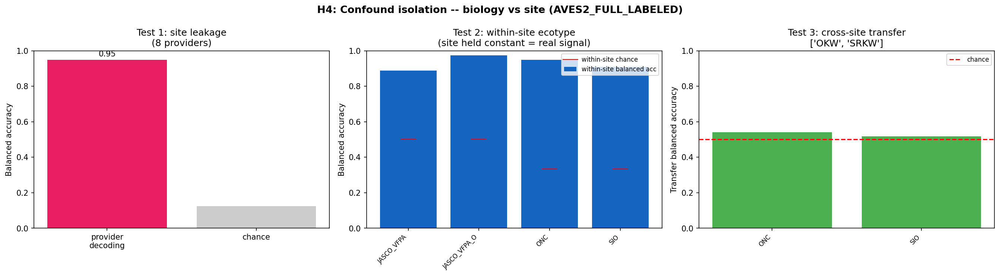</td>
<td><b>Site effects are quantified.</b><br/>Provider is highly decodable; within-site ecotype structure survives; cross-site ecotype transfer is near chance.<br/><sub>Scope: local ecotype signal with explicit provider controls.</sub></td>
</tr>
<tr>
<td width="34%">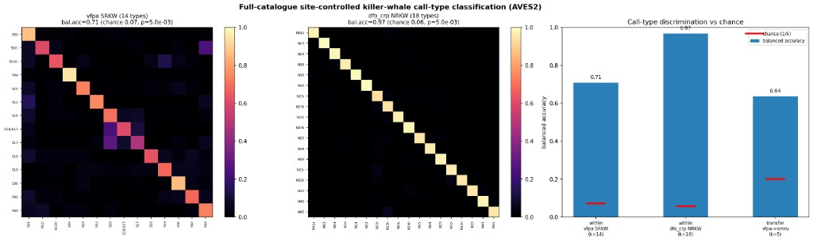</td>
<td><b>Catalogue call types transfer better than ecotype.</b><br/>SRKW and NRKW call-type identities are recovered above chance, and shared SRKW types transfer from VFPA to SMRU.<br/><sub>Scope: acoustic category recovery.</sub></td>
</tr>
<tr>
<td width="34%">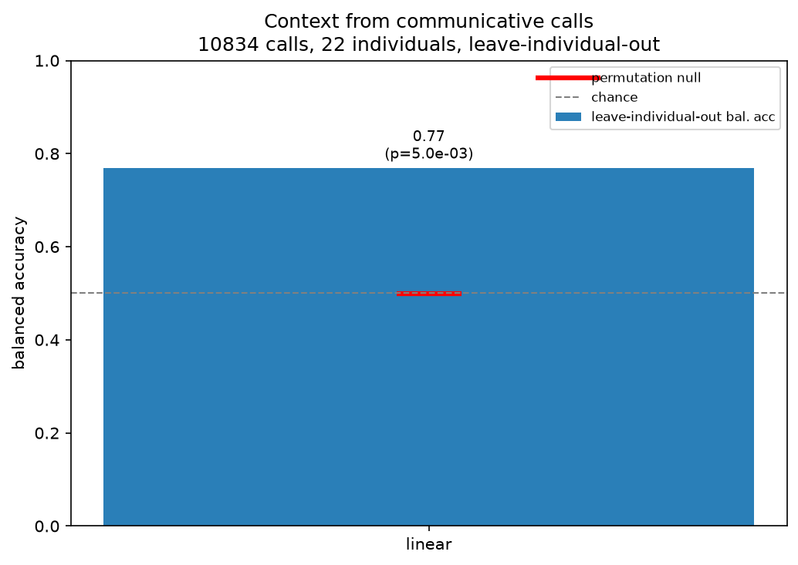</td>
<td><b>DTAG calls carry behavioural-context signal.</b><br/>Calls decode foraging/non-foraging and a three-way foraging/travelling/resting contrast with the individual held out.<br/><sub>Scope: production-side context association.</sub></td>
</tr>
<tr>
<td width="34%">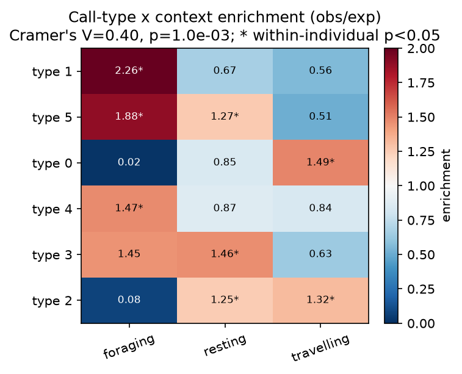</td>
<td><b>Specific call types are context-skewed.</b><br/>Call type by context selectivity is above the within-individual null (Cram&eacute;r's V = 0.40, p &lt; 0.001).<br/><sub>Scope: context-specific production within the available DTAG archive.</sub></td>
</tr>
<tr>
<td width="34%">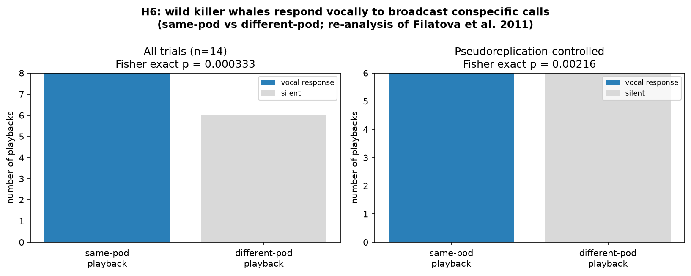</td>
<td><b>Published playback shows a dialect-selective receiver response.</b><br/>Re-analysis returns same-pod replies and different-pod silence under pseudoreplication control (`6/6` vs `0/6`, Fisher `p ~= 0.002`).<br/><sub>Scope: prior field playback; dialect membership is the tested contrast.</sub></td>
</tr>
<tr>
<td width="34%">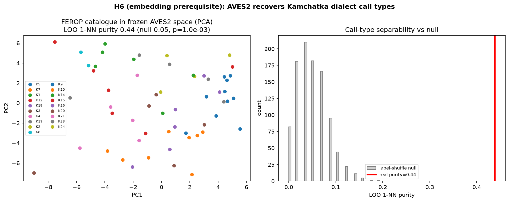</td>
<td><b>The encoder recovers the playback dialect space.</b><br/>Frozen AVES2 separates the Kamchatka catalogue call types underlying the response contrast (leave-one-out purity 0.439 vs 0.05 shuffle null).<br/><sub>Scope: representation of the stimulus space, paired with the published response data.</sub></td>
</tr>
<tr>
<td width="34%">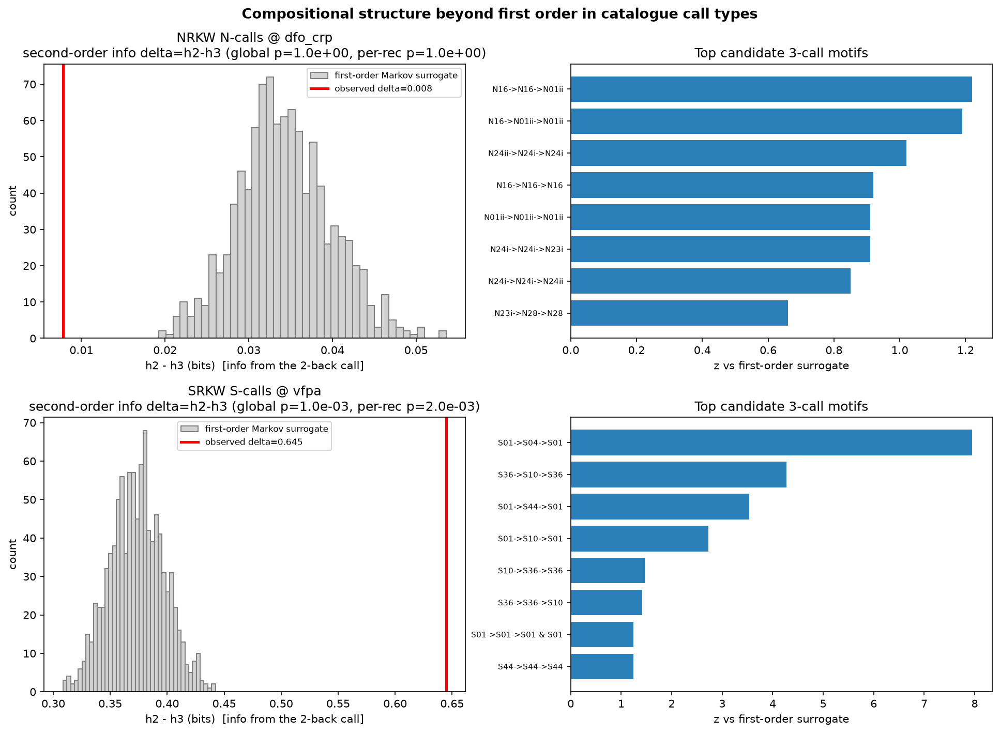</td>
<td><b>Southern-Resident call sequences exceed first-order structure.</b><br/>The call two steps back adds information beyond first-order Markov surrogates; Northern Residents are null and reported.<br/><sub>Scope: sequence structure over validated call types.</sub></td>
</tr>
<tr>
<td width="34%">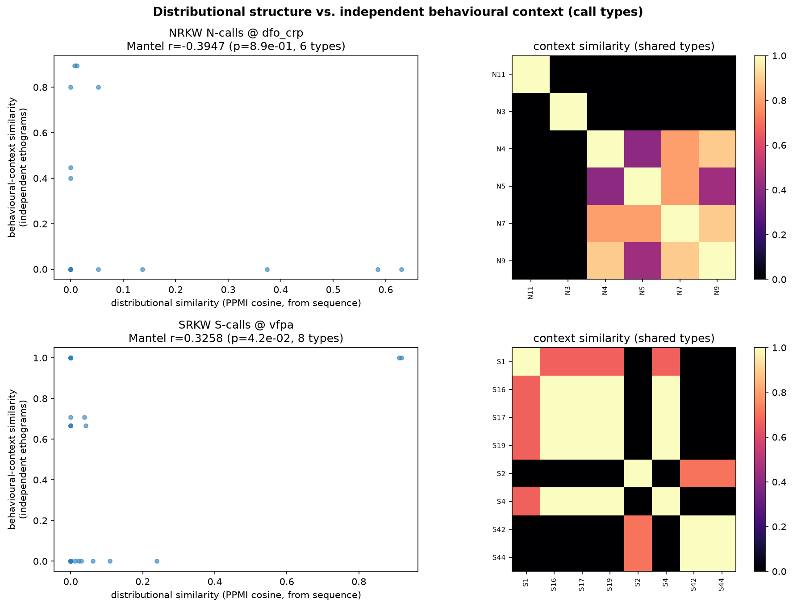</td>
<td><b>Sequence neighbourhood weakly tracks ethogram context in SRKW.</b><br/>Distributionally similar S-calls share independent literature-grounded context (Mantel r = 0.33, p = 0.042); NRKW is null.<br/><sub>Scope: modest type-level association, reported by population.</sub></td>
</tr>
<tr>
<td width="34%">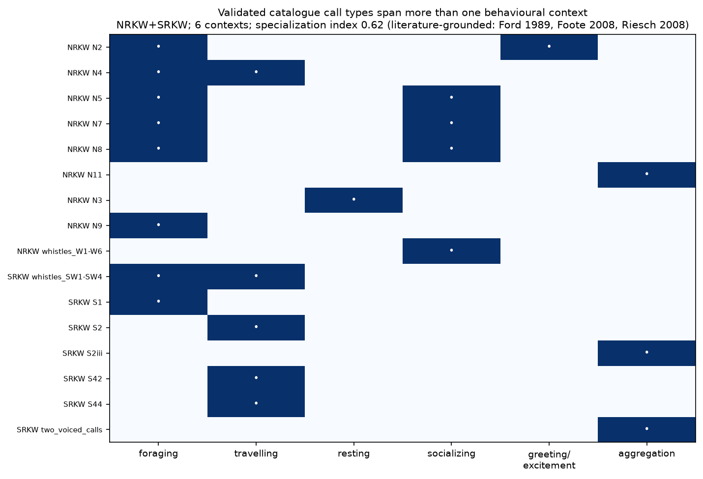</td>
<td><b>Named call types span several behavioural contexts.</b><br/>Validated catalogue call types are documented across six functionally distinct contexts, with a specialization index of 0.62.<br/><sub>Scope: literature-grounded context map.</sub></td>
</tr>
<tr>
<td width="34%">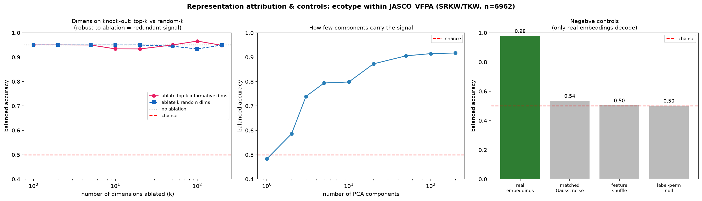</td>
<td><b>Negative controls stay near chance.</b><br/>The within-site decode sits above structure-matched noise, feature-shuffle, and label-permutation controls.<br/><sub>Scope: attribution and probe-control check on the frozen representation.</sub></td>
</tr>
<tr>
<td width="34%">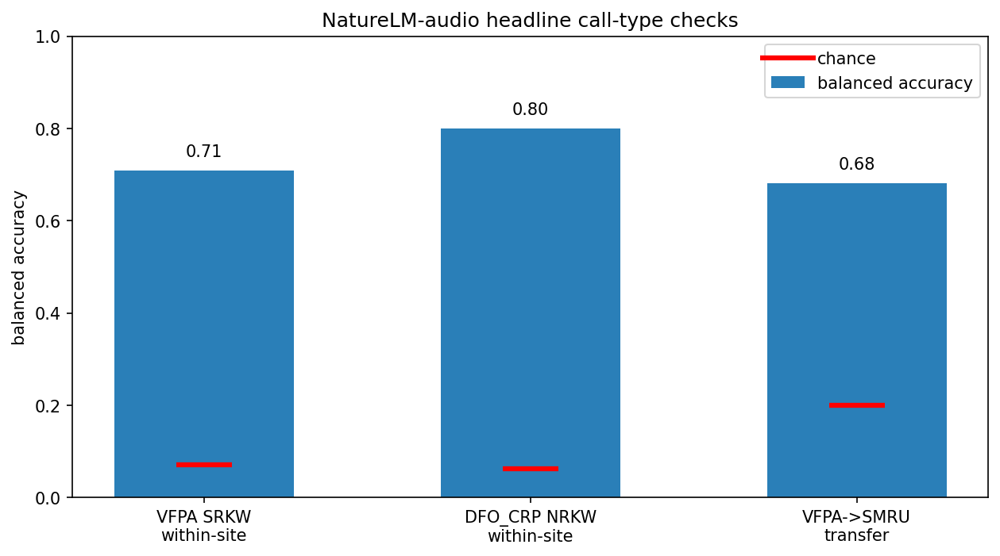</td>
<td><b>The call-type result repeats with NatureLM-audio.</b><br/>Frozen NatureLM-audio recovers site-controlled SRKW and NRKW call types above chance on full data.<br/><sub>Scope: second-encoder model-specificity check.</sub></td>
</tr>
<tr>
<td width="34%">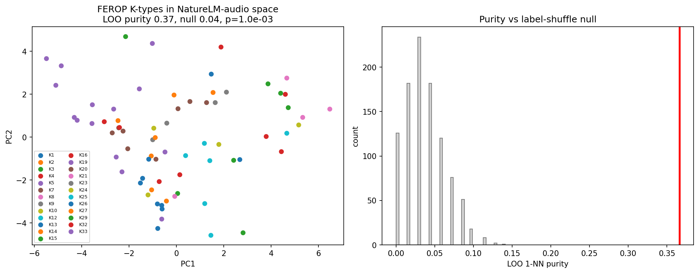</td>
<td><b>The playback dialect-space check also repeats with NatureLM-audio.</b><br/>FEROP K-type catalogue exemplars separate above proportional chance under the second encoder.<br/><sub>Scope: independent encoder check of the same bounded stimulus-space result.</sub></td>
</tr>
</table>

*Each panel is generated from committed reports or documented notebook outputs. Reproduction
status for every figure is in `docs/local_environment_manifest.md`.*

#### Narrative summary

- **Site control:** Pooled ecotype decodability overstates the ecotype signal because of a recording-site shortcut, and site-controlled evaluation separates within-site biological structure from the site effect [@stowell2022; @ghani2023]; stereotyped call-type identity, by contrast, is recoverable within a fixed site in both resident populations (SRKW 14-type 0.709, NRKW 18-type 0.968) and transfers across independent recording sites, the cross-site control the ecotype boundary fails [@ford1989; @filatova2015].
- **Production context:** On an independent animal-borne DTAG archive, communicative calls further carry decodable information about the caller's movement-defined behavioural context with the individual held out: foraging vs. non-foraging at 0.770 balanced accuracy, and a three-way foraging/travelling/resting contrast at 0.577 (chance 0.333) [@holt2024masking_data; @tennessen2019; @wilson2006]. Specific call types are produced context-specifically (call-type × context Cramér's V = 0.40, within-individual null p < 0.001), and the decode reflects call structure rather than call rate (0.536) or loudness (0.577). This is production-side context specificity across more than one behavioural context.
- **Perception-side playback:** On the **perception side**, a re-analysis of a published conspecific playback experiment shows wild killer whales produce a measurable, **dialect-selective response to broadcast calls** — they reply vocally to same-pod and not different-pod playbacks (6/6 vs 0/6, Fisher p = 0.002), naive free-ranging animals, often matching the played type — and frozen AVES2 recovers the dialect call-type space underlying the response contrast (leave-one-out purity 0.439 vs a 0.05 shuffle null, p = 1e-3) [@filatova2011playback; @russianorca_catalogue]. The playback experiment is prior published work re-analysed here, and dialect membership is the tested response contrast.
- **Second-encoder check:** The two primary representation checks also pass under frozen NatureLM-audio [@robinson2024naturelm] on full uncapped data: FEROP K-type separability (1-NN purity 0.366 vs proportional chance 0.050, p = 0.000999), VFPA/SRKW site-controlled call-type recovery (balanced accuracy 0.709 vs chance 0.071, p = 0.00498), DFO-CRP/NRKW recovery (0.800 vs 0.0625, p = 0.00498), and VFPA -> SMRU transfer over five shared SRKW types (0.682 vs chance 0.20). This is a cross-encoder model-specificity check.
- **Additional response and context evidence:** The response result is supported by independent datasets — killer whales avoid broadcast pilot-whale sound against matched controls [@selbmann2026aversive], orca-call structure drives receiver heading change [@bowers2018], and receivers match a preceding caller's type in natural exchanges [@miller2004repertoires] — and, on the production side, the recovered catalogue call types specialize across functionally distinct contexts: 72% are single-context foraging- or socializing-specialists (e.g. N4/N9 foraging vs the multi-pod two-voiced calls socializing), and the same named units are documented across **six** distinct behavioural contexts, not just movement state [@ford1989; @foote2008; @riesch2008].
- **Structure side:** Two further analyses add structure-side detail: SRKW S-call sequences carry **compositional structure beyond first order** — the call two steps back adds information a first-order Markov model cannot explain (second-order delta 0.645 bits, p ~= 1e-3; candidate phrase S01->S04->S01), in the spirit of sperm-whale coda analysis [@sharma2024; @berthet2025bonobo; @crockford2025] — while a label-free site-invariance transform modestly improves cross-site ecotype transfer (0.597 -> 0.625) without disturbing the within-site signal [@stowell2022; @ghani2023].
- **Distributional semantics:** Finally, a distributional-semantics test compares sequence structure with behavioural context **non-circularly**: in Southern Residents, call types that keep similar sequential company also share independent, literature-grounded behavioural context (Mantel r = 0.33, p = 0.042, 8 types), with Northern Residents null (r = -0.39). This is reported as a modest type-level association, with both populations shown [@berthet2025bonobo; @crockford2025; @ford1989; @foote2008].

### Detailed per-head results

| Head | Purpose | Current readout |
|---|---|---|
| H1 | Supervised ecotype probes | Pooled balanced accuracy 0.910 (MLP accuracy 0.974) collapses to 0.231 (chance 0.250) under leave-one-provider-out: the pooled number is a site-confounded upper bound. |
| H4 | Provider/site control | Provider is decodable at balanced accuracy 0.948; within-site ecotype discrimination stays at 0.889-0.973 (p = 0.005) across five providers, separating biological structure from the site effect, but cross-site ecotype transfer is near chance (0.529). |
| H8 | Label-free site-invariance transform (methods) | A StandardScaler + PCA + site-nuisance subspace projection modestly improves cross-site ecotype transfer (e.g., SRKW vs TKW 0.597 -> 0.625; leave-one-provider-out 4-way ecotype 0.402 -> 0.445 vs a 0.234 permutation null, p = 0.005) while preserving within-site ecotype (0.883 -> 0.876 after removing 8 nuisance dimensions). A methods contribution; recovery is bounded because ecotype and recording site are confounded in this corpus (SAR is single-provider) [@stowell2022; @ghani2023]. |
| Call type | Site-controlled call-type model | With catalogue labels recovered from the DCLDE per-provider annotations (full catalogue, 8,552 detections encoded), frozen embeddings discriminate call types within a fixed site at balanced accuracy 0.709 for 14 SRKW S-call types (chance 0.071) and 0.968 for 18 NRKW N-call types (chance 0.056), both p ~= 0.005. A VFPA-trained SRKW classifier scores 0.636 on the independent SMRU site over 5 shared types (chance 0.20; 0.830 over the 4 unambiguous types): call-type identity transfers across sites, unlike ecotype (0.529). |
| H2 | Unsupervised structure | PCA + HDBSCAN ARI 0.043 versus ecotype (p = 0.002), above the shuffled-label null but small and parameter-sensitive. |
| H3 | Encounter sequence structure | Balanced 40-token vocabulary (entropy 5.24/5.32 bits): adjacent-call mutual information 1.91 bits versus an order-shuffle null of 1.65 bits (p < 0.001), still 1.09 bits after removing repetition, and a held-out bigram beats a unigram by 1.74 bits/token. A masked-LM order test returns a null on the same data; the better-powered Markov test is reported alongside it. |
| Rung 4 (validated) | Call-type syntax | Re-running the first-order test on the *validated* catalogue call types (site held constant, within-recording shuffle null) is positive in both resident populations: NRKW (31 N-call types, 5,273 calls) adjacent-pair MI 2.85 bits vs null 1.71 (p = 1e-3), 1.60 bits after removing heavy bouting (self-transition 0.92), bigram beats unigram by 2.73 bits/token; SRKW (19 S-call types) MI 1.29 vs 0.78 (p = 1e-3). This repeats the sequence test on validated biological units. |
| H7 (compositionality) | Structure *beyond* first order | Tested against first-order Markov surrogates (which preserve unigram + bigram statistics, so any excess cannot be a re-detection of pairwise structure), the call two steps back adds information a first-order model cannot explain in **SRKW S-calls** (second-order information delta = 0.645 bits, p ~= 1e-3 against both global and per-recording surrogates; held-out trigram beats bigram by 0.09 bits/token; top candidate 3-call phrase S01->S04->S01 at z = 7.95) but **not** in NRKW N-calls (delta = 0.008, p = 1.0, despite heavy bouting). This is a beyond-first-order combinatorial test, in the spirit of sperm-whale codas and primate compositionality [@sharma2024; @berthet2025bonobo; @crockford2025], with both populations reported. |
| Rung 1 (unsup.) | Unsupervised call-type discovery | Within-SRKW clusters are 93% dominated by a single recording provider (82% noise): the categories are real but too fine to fall out of unsupervised clustering of site-confounded embeddings, which is why the supervised call-type model above uses catalogue labels. |
| H5 | DTAG behavioural-context decode (multi-context) | On an independent archive of animal-borne DTAG recordings, communicative calls predict the caller's movement-only behavioural context (labelled from tag depth and acceleration alone) under leave-individual-out evaluation: foraging vs. non-foraging at 0.770 balanced accuracy across 22 whales (10,834 calls, p = 0.005), and a three-way foraging/travelling/resting contrast at 0.577 across the 20 whales carrying all three contexts (chance 0.333, p = 0.005). Specific call types are produced context-specifically (call-type × context Cramér's V = 0.40 vs within-individual null 0.08, p < 0.001; every cluster context-enriched [@ford1989; @foote2008]). Controls address call rate (0.536), loudness (0.577), and click-like clips (dropping the top 25% leaves 0.749; clips are 16 kHz, so echolocation peak energy is absent) [@wilson2006]. Because the individual is held out and the label never sees the audio, this is reported as context-specific *production* across more than one behavioural context. |
| H6 | Playback receiver-response (perception side) | Re-analysis of a published conspecific playback experiment [@filatova2011playback]: wild killer whales reply vocally to same-pod calls and stay silent to different-pod calls (8/8 vs 0/6 raw; **6/6 vs 0/6 after pseudoreplication control, Fisher p = 0.002**), naive free-ranging animals, often matching the played type [@miller2004repertoires]. Frozen AVES2 recovers the Kamchatka dialect call-type space underlying this contrast (leave-one-out 1-NN purity **0.439** vs a label-shuffle null of 0.050, p = 1e-3) [@russianorca_catalogue]. Supported by independent broadcast-response datasets [@selbmann2026aversive; @bowers2018] (see `reports/broadcast_response_evidence.json`). The behavioural experiments are prior published work; dialect membership is the tested contrast. |
| NatureLM-audio check | Second-encoder check | The frozen NatureLM-audio audio encoder [@robinson2024naturelm] repeats the two primary representation checks on full uncapped data (`reports/naturelm_analysis_readout.json`): FEROP K-type catalogue separability is above chance (1-NN purity **0.366** vs proportional chance 0.050, p = 0.000999); site-controlled call-type recovery is above chance for VFPA/SRKW (**0.709** vs 0.071, p = 0.00498) and DFO-CRP/NRKW (**0.800** vs 0.0625, p = 0.00498); VFPA -> SMRU transfer reaches **0.682** over five shared SRKW types (chance 0.20). This checks model specificity. |
| Catalogue context | Multi-context specialization of recovered call types | The validated Rung-1 catalogue call types specialize across functionally distinct contexts: **72% (13/18) are single-context foraging- or socializing-specialists** (foraging-specialists N4, N9; socializing-specialists the multi-pod two-voiced and pod-identity calls), specialization index 0.72, disjointness Fisher p = 0.069 [@ford1989; @foote2008]. Broadening the axis beyond foraging-vs-social, the same named units are documented across **six** functionally distinct behavioural contexts (foraging, travelling, resting, socializing, greeting/excitement, multi-pod aggregation; 16 types, specialization index 0.62) — so context breadth holds beyond movement state at the named-unit level [@ford1989; @foote2008; @riesch2008; @yurk2002]. Context labels are from published ethograms (not embeddings), so this is a non-circular contextual map complementing the H5 decode (the chi-square non-uniformity across contexts is suggestive only, p = 0.086, small n). |
| Distributional semantics | Sequential structure ↔ behavioural context (non-circular) | Each call type's PPMI co-occurrence vector (from **sequence only**) is compared to its **independent** published-ethogram context vector by a Mantel test. **SRKW: positive** — distributionally similar S-calls share behavioural context (r = 0.33, p = 0.042, 8 types, 28 pairs); **NRKW: null** (r = -0.39, p = 0.89, 6 types). A non-circular test of the distributional hypothesis the bonobo/chimpanzee finalists assume [@berthet2025bonobo; @crockford2025]; modest and borderline (small n, type-level human-projected context labels), reported both ways. |
| Attribution | Representation attribution + negative controls | The within-site ecotype signal is multi-dimensional and redundantly distributed (a single AVES2 dimension is at chance; a low-rank PCA projection recovers most of it; ablating the top-k individually-important dimensions does not collapse the decode). It is not a probe artifact: structure-matched Gaussian noise (0.54) and per-dimension feature-shuffle (0.50) fall to near chance, while the decode is 0.98 against a label-permutation null of 0.50 (p ~= 0.008). |
| Legacy context heads | Exploratory only | The earlier Wellard recording-level context heads and a within-encounter timing proxy are weak recording-level associations, not segment-level behaviour and not response evidence; retained for comparison only (see `docs/evidence_mapping.md`). |

All metrics above are computed on the public DCLDE 2026 corpus [@palmer2025dclde; @palmer2025dclde_data] with frozen AVES2 embeddings [@hagiwara2023aves; @chen2022beats]; the call-type labels are Ford/Filatova catalogue codes [@ford1989; @filatova2015] and the H5 row uses the independent DTAG archive [@holt2024masking_data; @tennessen2019].

The evidence ladder for the bounded "decoding" claim, the verified public-data ceiling,
and what remains gated on field playback are documented in `docs/decoding_program.md`.

## Scope of Inference

This project supports claims about:

- acoustic structure;
- site-controlled label decodability (ecotype and catalogue call type);
- cross-site call-type transfer;
- non-random clustering;
- non-random first-order call-sequence structure (over both k-means tokens and the validated catalogue call types, site-controlled);
- **context-specific production of communicative calls across more than one movement-defined behavioural context, with the individual held out** (DTAG H5: foraging/non-foraging and a three-way foraging/travelling/resting decode, with call-type × context selectivity and rate/loudness/echolocation controls);
- a **dialect-selective receiver response to broadcast conspecific calls** supported by re-analysis of a published playback experiment (H6: same-pod vs different-pod, 6/6 vs 0/6, p = 0.002, naive animals), with the recording-site confound explicitly quantified;
- **combinatorial structure beyond first order in Southern-Resident call sequences** (H7; null in Northern Residents);
- **behavioural-context breadth across six functionally distinct contexts** at the named-unit level (catalogue map);
- a label-free **site-invariance transform** (H8, methods).

Interpretation is limited to these acoustic and behaviour-linked readouts; translation-level
or call-content interpretation would require stronger behavioural tests.

Two interpretation notes on the response result:

- First, the **playback experiment is prior published work** [@filatova2011playback]; this repository re-analyses it with a reproducible statistic plus an embedding model of the associated dialect space.
- Second, the tested playback contrast is **dialect membership** (same vs different pod), which shows that receivers act on a broadcast endogenous signal under that contrast.

The DTAG context result is the *production* side of context-specificity (which call types
are emitted in which context); the call-type result is call-type discrimination (labels
correlate with pod/matriline); and the sequence-structure result is a prerequisite for
combinatorial coding. Testing whether a receiver response is governed by call *content*
requires a controlled conspecific playback isolating content, which remains future work.

**Remaining field test.** Public-data re-analysis addresses:

- validated call units (Rung 1);
- first-order and — in Southern Residents — beyond-first-order sequence structure (H7);
- context-specific production across more than one behavioural context (DTAG H5 plus the six-context catalogue map);
- a measurable receiver response to broadcast conspecific calls (H6, by re-analysis);
- a label-free site-invariance transform (H8).

The remaining step is a **controlled conspecific playback that isolates call *content***:
a field experiment beyond what larger models or archival audio can settle on their own.
Because the production-context corpus (Pacific N/S-calls) and the only conspecific-playback
corpus (Kamchatka K-calls) are non-overlapping catalogues, even joining production and
perception on a single named unit needs new field data
(`docs/decoding_program.md` §9).

## Known Limitations and Mitigations

The full public limitation register is
[`docs/limitations_and_mitigations.md`](docs/limitations_and_mitigations.md). The short
version:

| Potential issue | Relevance | Current handling |
|---|---|---|
| Unknown sensory channels / whale "umwelt" | Orcas may use signal dimensions or multimodal cues that are not captured by archival hydrophone audio [@kershenbaum2024whyanimalstalk]. | Claims are limited to recorded underwater acoustic structure and measured behaviour-linked response. |
| Bandwidth, equipment, and file-format heterogeneity | Killer whales hear across roughly 1-100 kHz, with high sensitivity in ultrasonic ranges; public archives differ in sampling, filters, hydrophones, gain, annotations, and conversion paths [@szymanski1999hearing; @palmer2025dclde; @johnson2003dtag]. | Provider/site is measured explicitly; readouts are within-site or explicit cross-site transfer where specified. DTAG conversions and derived artifacts are provenance-documented. |
| Identity, dialect, and social-group confounds | Resident call types are socially structured, so a model can recover dialect or group membership without recovering content. | The playback result is framed as a dialect-selective receiver response. A content-controlled conspecific playback remains the critical field test. |
| Prior playback evidence | The receiver-response experiment was published field work reused here [@filatova2011playback]. | The contribution here is reproducible re-analysis and representation modelling of the dialect signal space. New permitted field playback remains future work. |
| Model specificity | A result might be an artifact of one frozen encoder. | AVES2 is the primary encoder; the two primary representation checks also pass under NatureLM-audio [@hagiwara2023aves; @chen2022beats; @robinson2024naturelm]. Agreement across encoders addresses model specificity. |

## Quickstart

### Smoke test

Fast verification from a clean clone:

```bash
python -m pip install -e ".[dev,analysis]"
python -m pytest -q
python scripts/run_playback_response_stats.py
```

Expected smoke-test result: tests pass, and the playback-response re-analysis prints
the pseudoreplication-controlled same-pod vs different-pod result (`6/6` vs `0/6`,
Fisher exact `p ~= 0.002`). The first install is large because the package includes
the AVES2/audio analysis stack.

### Full public-data analysis

Full public-data analysis entry points:

```bash
python scripts/download_annotations.py
python scripts/download_sample_audio.py
python scripts/hello_world.py

python scripts/batch_encode_streaming.py --device cuda --max-file-size-mb 1024
python scripts/add_labels_from_metadata.py \
    --input data/embeddings/aves2_full_embeddings.npz \
    --output data/embeddings/aves2_full_labeled.npz

python scripts/run_h1_probes.py --embeddings data/embeddings/aves2_full_labeled.npz \
    --n-perm 1000 --perm-train-subsample 2000 --group-field provider
python scripts/run_h2_clustering.py --embeddings data/embeddings/aves2_full_labeled.npz \
    --min-cluster-size 25 --min-samples 5
python scripts/run_h3_sequence_lm.py --embeddings data/embeddings/aves2_full_labeled.npz \
    --epochs 30 --n-perm 100 --device cuda --vocab-size 40
python scripts/run_h4_confound.py --embeddings data/embeddings/aves2_full_labeled.npz \
    --n-perm 200 --min-per-class 40

python scripts/build_calltype_manifest.py
python scripts/run_calltype_model.py \
    --embeddings data/embeddings/aves2_full_labeled.npz \
    --manifest data/join_tables/call_type_manifest.csv --min-per-type 30
python scripts/run_calltype_sequence.py \
    --manifest data/join_tables/call_type_manifest.csv --n-perm 1000

# Representation attribution + negative-control battery (runs on the frozen artifact)
python scripts/run_attribution_controls.py \
    --embeddings data/embeddings/aves2_full_labeled.npz \
    --provider JASCO_VFPA --classes SRKW TKW

# H6 — receiver response to broadcast conspecific calls (perception side)
python scripts/run_playback_response_stats.py          # differential-response stat (no audio needed)
python scripts/build_playback_manifest.py              # fetch public FEROP call catalogue
python scripts/run_playback_response.py --n-perm 1000  # AVES2 dialect-separability + null
python scripts/summarize_broadcast_response.py         # broadcast-response evidence roll-up across datasets

# Catalogue context specialization (foraging-vs-social, then full multi-context breadth)
python scripts/run_calltype_context_specialization.py
python scripts/run_calltype_multicontext.py            # 6 behavioural contexts at the named-unit level

# H7 — compositional structure beyond first order (validated catalogue call types)
python scripts/run_calltype_compositionality.py --n-surrogate 1000

# H8 — label-free site-invariance transform (methods; runs on the frozen artifact)
python scripts/run_site_invariance.py --embeddings data/embeddings/aves2_full_labeled.npz
```

### DTAG behavioural-context decode

The behavioural-context decode (H5) runs end-to-end in Colab via
`notebooks/dtag_context_decode_colab.ipynb`, which downloads each public DTAG deposit,
losslessly decodes the `.dtg` audio, detects communicative calls, builds movement-only
context labels, encodes with frozen AVES2, and runs the leave-individual-out decode and
permutation null (`scripts/dtag_context_labels.py`, `dtag_context_decode.py`,
`dtag_context_multidecode.py`, `dtag_calltype_context.py`, `dtag_context_controls.py`;
`scripts/dtag_local_extract.py` is the local decoder fallback). The earlier Wellard
recording-level scripts (`build_wellard_evidence_tables.py`, `run_h5_behavior_context.py`,
`run_h6_context_structure.py`, `run_h7_candidate_motifs.py`) are retained as exploratory
comparison only and are not used for the main claims.

### NatureLM-audio comparison

The second-encoder check runs in Colab via
`notebooks/naturelm_audio_comparison_colab.ipynb`. It requires a GPU runtime and a
Google Drive mount. The notebook loads only the NatureLM-audio BEATs encoder weights
(not the Llama text generator), pins the upstream NatureLM-audio code revision, and
persists the Hugging Face cache, source-audio cache, embeddings, reports, and figures
under `MyDrive/OrcaDolittle_naturelm` so Colab disconnects can resume. The completed
full-analysis run is committed as:

- `reports/naturelm_analysis_readout.json` and `.md`;
- `reports/naturelm_calltype_model_summary.json`;
- `reports/naturelm_playback_embedding_summary.json`;
- `reports/naturelm_model_manifest.json` and `reports/naturelm_environment.json`;
- `reports/naturelm_calltype_manifest_resolved.csv`;
- `figures/naturelm_calltype_model.png`;
- `figures/naturelm_playback_embedding.png`.

It re-runs two bounded comparison checks:

- FEROP playback-dialect call-type separability;
- site-controlled catalogue call-type classification, including VFPA -> SMRU transfer.

The committed run completed with `RUN_MODE = FULL_ANALYSIS`, `MAX_CALLTYPE_SEGMENTS = 0`,
1,000 FEROP permutations, and 200 call-type permutations per within-provider model.

## Repository Map

| Path | Purpose |
|---|---|
| `pyproject.toml` | Python package metadata and dependencies. |
| `scripts/` | Download, encoding, labelling, and analysis entry points. |
| `docs/ai_architecture.md` | Architecture and statistical validation specification. |
| `docs/dataset_plan.md` | Dataset provenance, access, and quality plan. |
| `docs/evidence_mapping.md` | Evidence axes, controls, and claim scope. |
| `docs/decoding_program.md` | Evidence map and verified public-data ceiling. |
| `docs/data_availability.md` | Per-source data inventory for the context and responsiveness rungs. |
| `docs/limitations_and_mitigations.md` | Public limitation register: unknown-channel, bandwidth/equipment, conversion, dialect, playback, and model-specificity scope. |
| `docs/local_environment_manifest.md` | Full accounting of every artifact (committed vs Zenodo-deposited vs external public source), per-head reproduction status, and independent local reproduction. |
| `docs/results_analysis.md` | Current run interpretation and limitations. |
| `docs/literature_review.md` | Cited literature map. |
| `docs/refs.bib` | Bibliography source used by the repository. |
| `notebooks/` | Colab pipelines (full-catalogue call-type encode; DTAG context decode; NatureLM-audio comparison). |
| `data/join_tables/` | Small metadata joins and provenance tables. |
| `data/embeddings/` | Compact derived embedding artifacts. |
| `reports/` | Run metadata and reproducibility summaries. |
| `figures/` | Generated analysis figures. |

## Maintainer

Danielle Lesin, Georgia Institute of Technology, College of Computing.
